```mermaid
graph LR
    VSCode_Extension_Host["VSCode Extension Host"]
    Extension_Main_Controller["Extension Main Controller"]
    Webview_UI_Manager["Webview UI Manager"]
    Code_Analysis_Service["Code Analysis Service"]
    Graph_Data_Processor["Graph Data Processor"]
    Visualization_Frontend["Visualization Frontend"]
    Gemini_API_Client["Gemini API Client"]
    Unclassified["Unclassified"]
    Unclassified["Unclassified"]
    Unclassified["Unclassified"]
    VSCode_Extension_Host -- "loads and activates" --> Extension_Main_Controller
    Extension_Main_Controller -- "initiates code analysis" --> Code_Analysis_Service
    Code_Analysis_Service -- "sends raw analysis data to" --> Graph_Data_Processor
    Graph_Data_Processor -- "sends processed graph data to" --> Webview_UI_Manager
    Webview_UI_Manager -- "renders and facilitates communication with" --> Visualization_Frontend
    Visualization_Frontend -- "sends user interaction events back to" --> Webview_UI_Manager
    Extension_Main_Controller -- "calls for AI-powered insights" --> Gemini_API_Client
    Gemini_API_Client -- "returns AI-powered insights to" --> Extension_Main_Controller
```

## Details

The CodeBoarding VSCode extension operates as a multi-component system designed to analyze and visualize code structures. The core functionality resides within the VSCode Extension Host, which provides the runtime environment for the extension. The Extension Main Controller acts as the central orchestrator, managing the extension's lifecycle, user interactions, and coordinating with backend services. Code analysis is performed by the Code Analysis Service, which extracts structural and control flow information. This raw data is then transformed into a visualizable format by the Graph Data Processor. The processed data is finally rendered to the user through the Webview UI Manager and the interactive Visualization Frontend. Additionally, the Gemini API Client integrates external AI capabilities, providing enhanced insights based on the code analysis.

### VSCode Extension Host
The foundational environment provided by Visual Studio Code that hosts and executes the extension, managing its lifecycle and access to VSCode APIs.

**Related Classes/Methods**:

- <a href="https://github.com/CodeBoarding/CodeBoarding-vscode/blob/main/webview-ui/src/types/vscode.d.ts#L3-L5" target="_blank" rel="noopener noreferrer">`vscode`:3-5</a>

### Extension Main Controller
The primary orchestrator of the VSCode extension, handling activation, registering user commands, managing configuration, and coordinating interactions between the VSCode environment, analysis services, and the webview UI.

**Related Classes/Methods**:

- <a href="https://github.com/CodeBoarding/CodeBoarding-vscode/blob/main/backend/extension.ts#L1-L10" target="_blank" rel="noopener noreferrer">`activate`:1-10</a>

### Webview UI Manager
Responsible for the creation, lifecycle management, and secure communication channel for the VSCode Webview panel, acting as a bridge between the extension host and the frontend.

**Related Classes/Methods**:

- <a href="https://github.com/CodeBoarding/CodeBoarding-vscode/blob/main/backend/DiagramViewProvider.ts" target="_blank" rel="noopener noreferrer">`DiagramViewProvider`</a>

### Code Analysis Service
An independent service that performs static and dynamic analysis of source code, processing files locally to extract structural and control flow information.

**Related Classes/Methods**:

- <a href="https://github.com/CodeBoarding/CodeBoarding-vscode/blob/main/webview-ui/src/components/CodeBoardingApp.tsx#L22-L54" target="_blank" rel="noopener noreferrer">`AnalysisService`:22-54</a>

### Graph Data Processor
Transforms the raw analysis output from the `Code Analysis Service` into a standardized, structured graph data model (nodes and edges) optimized for efficient rendering by the visualization frontend.

**Related Classes/Methods**:

- <a href="https://github.com/CodeBoarding/CodeBoarding-vscode/blob/main/webview-ui/src/utils/graph-converter.ts#L50-L106" target="_blank" rel="noopener noreferrer">`convertToReactFlow`:50-106</a>

### Visualization Frontend
The main interactive user interface, built with React, that runs within the VSCode Webview. It receives processed graph data and renders the visual representation of the code's control flow, managing UI state and user interactions.

**Related Classes/Methods**:

- <a href="https://github.com/CodeBoarding/CodeBoarding-vscode/blob/main/webview-ui/src/App.tsx#L4-L13" target="_blank" rel="noopener noreferrer">`App`:4-13</a>
- <a href="https://github.com/CodeBoarding/CodeBoarding-vscode/blob/main/webview-ui/src/components/CodeBoardingGraphViewer.tsx#L69-L343" target="_blank" rel="noopener noreferrer">`CodeBoardingGraphViewer`:69-343</a>

### Gemini API Client
Manages secure communication with the external Gemini 2.5-flash API, sending code snippets or analysis results for AI-powered insights and receiving enhanced information.

**Related Classes/Methods**:

- `GeminiService`:1-10

### Unclassified
Component for all unclassified files and utility functions (Utility functions/External Libraries/Dependencies)

**Related Classes/Methods**: _None_

### Unclassified
Component for all unclassified files and utility functions (Utility functions/External Libraries/Dependencies)

**Related Classes/Methods**: _None_

### Unclassified
Component for all unclassified files and utility functions (Utility functions/External Libraries/Dependencies)

**Related Classes/Methods**: _None_

### [FAQ](https://github.com/CodeBoarding/GeneratedOnBoardings/tree/main?tab=readme-ov-file#faq)